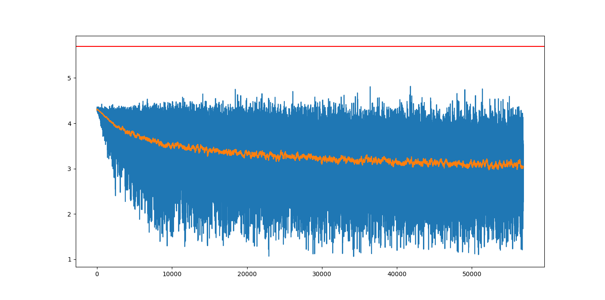
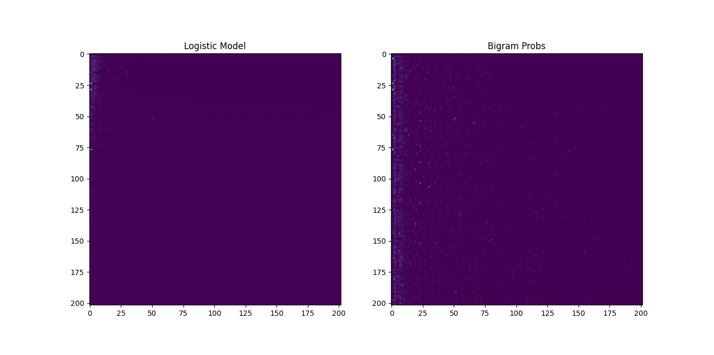
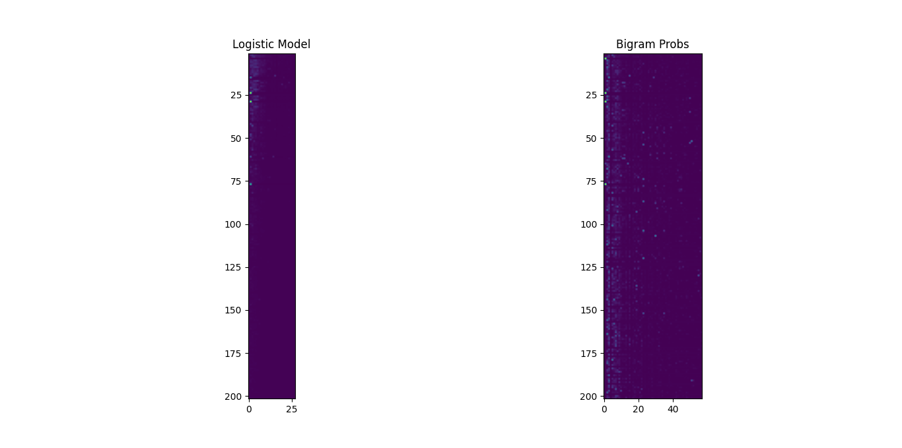
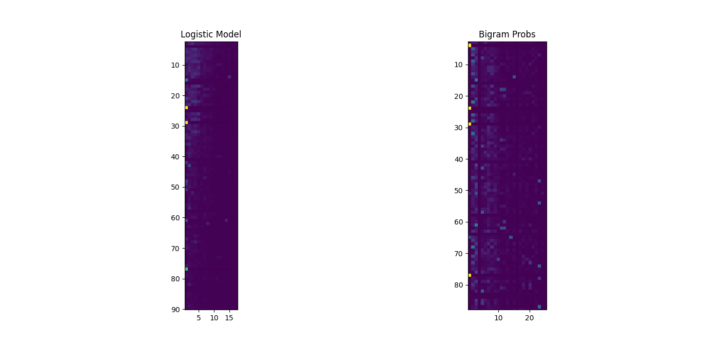

# Directory Structure
```text
.
├── figures
│   ├── Figure_1.png
│   ├── Figure_2.png
│   ├── Figure_3.png
│   └── Figure_4.png
├── models
│   ├── embedding.py
│   ├── __init__.py
│   └── net.py
├── README.md
├── run.py
└── utils
    ├── __init__.py
    ├── logistic.py
    ├── onehot.py
    └── plot.py

3 directories, 14 files
```


# Data - Brown Corpus Sentences

# Build FeedForward Bi-Gram Model with OneHotEncoding

## 1-Layer
## Logistic

# Train the Bi-Gram model


## Training Procedure


## Compare Logistic & Bigram models

## Medium Zoom In

## Extra Zoom In


# Under The Maintenance...